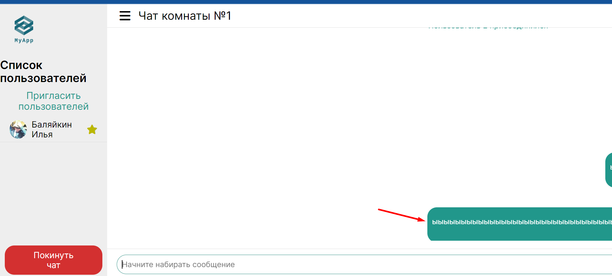

1. Стоит добавить проверку на пустую строку, чтобы не было возможности отправлять пустое сообщение. 
2. По поводу скрола в самый низ, посмотри
   вот https://stackoverflow.com/questions/40730116/scroll-to-bottom-of-div-with-vue-js
3. Вот что происходит когда сообщение очень длинное, сообщение должно расти в высоту когда ширина контейнера достигает
   како-то максимального значения 
4. Между классами стилей должна быть одна пустая строка
